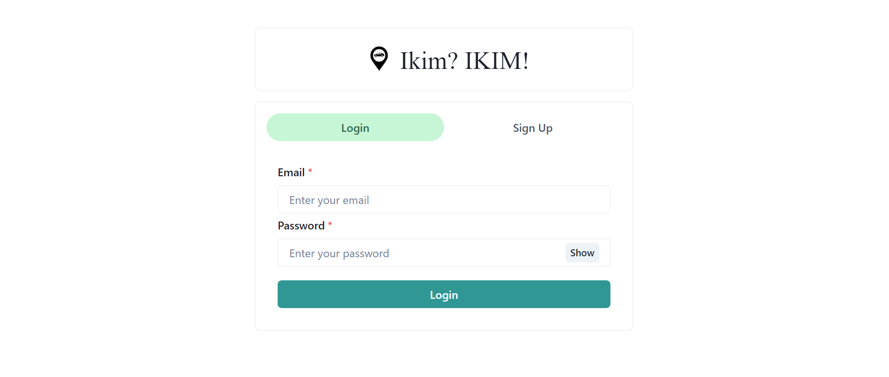
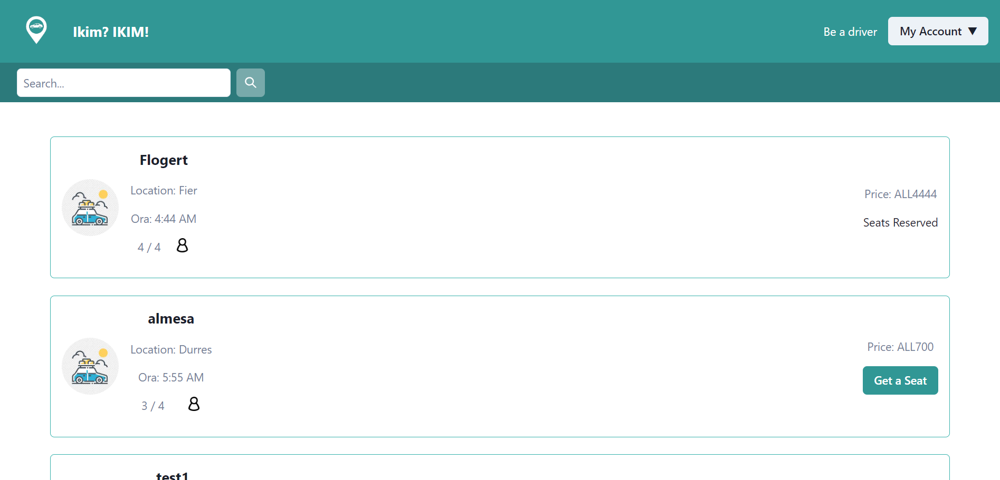
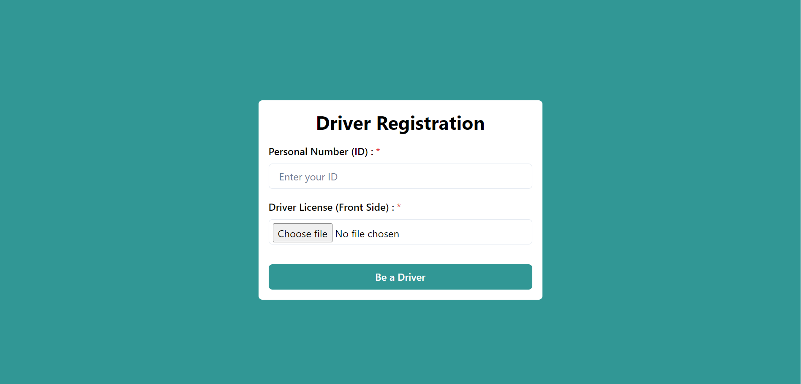
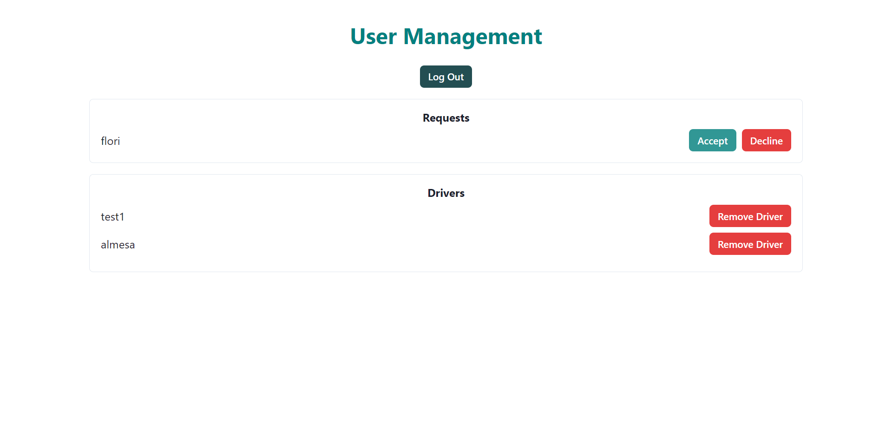
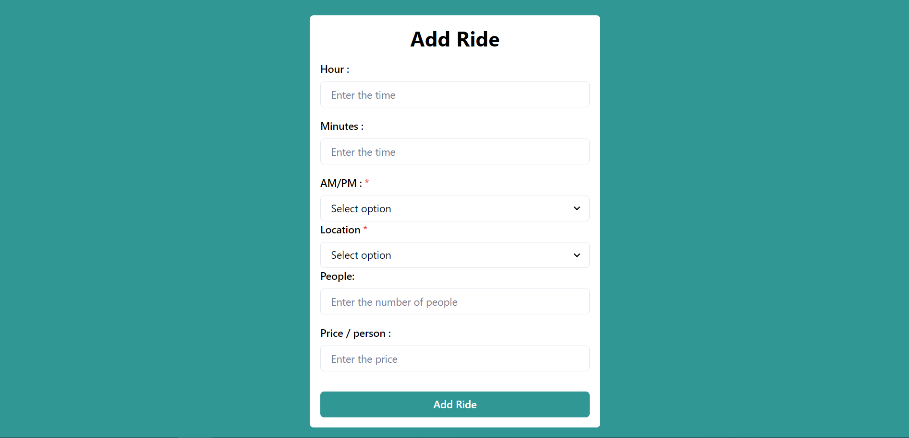

# Ikim? IKIM!
Ikim? IKIM! is a user-friendly carpooling application that aims to revolutionize the way people commute, promoting a greener and more efficient transportation system. The app brings together drivers and passengers who share similar routes, making it convenient for them to carpool, save money, and reduce their carbon footprint.

*Please note that this project is currently incomplete and is actively maintained.*

**Developed by:** Almesa Metohu, Bruno Skendaj, Keidi Sheremeti

## Contact

If you have any questions or feedback, please feel free to reach out to us at [almesametohu11@gmail.com](mailto:almesametohu11@gmail.com).